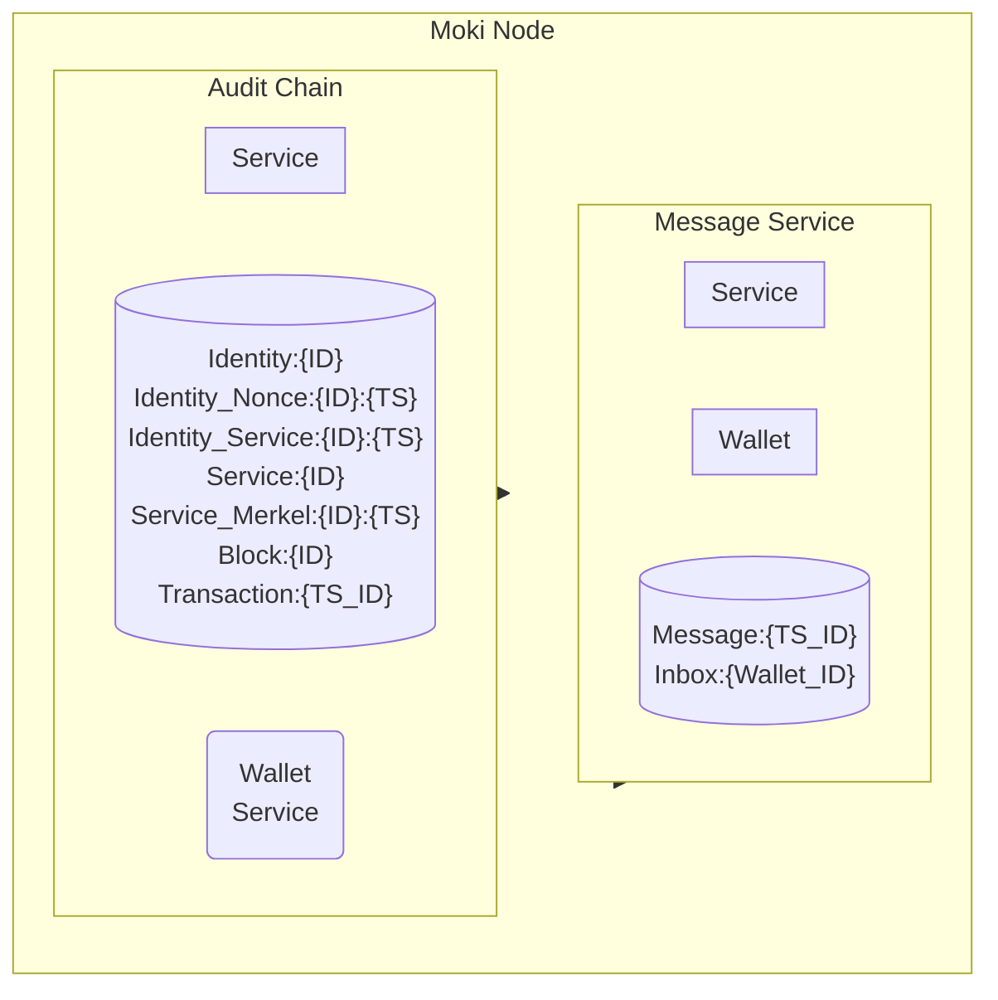

# Overview

Here is a basic overview of the node setup of Moki

```mermaid
flowchart RL
        node-->audit_chain
        node-->message_service
    subgraph node[Moki Node]
        subgraph audit_chain[Audit Chain]
            direction LR
            ADB@{ shape: cyl, label: "Identity:{ID}<br/>Identity_Nonce:{ID}:{TS}<br/>Identity_Service:{ID}:{TS}<br/>Service:{ID}<br/>Service_Merkel:{ID}:{TS}<br/>Block:{ID}<br/>Transaction:{TS_ID}" }
            ad("Wallet<br/>Service")
            subgraph as[Service]
            end
        end
        subgraph message_service[Message Service]
            direction LR
            MDB@{ shape: cyl, label: "Message:{TS_ID}<br/>Inbox:{Wallet_ID}<br/>" }
            subgraph mw[Wallet]
            end
            subgraph ms[Service]
            end
        end
    end
```

that was it